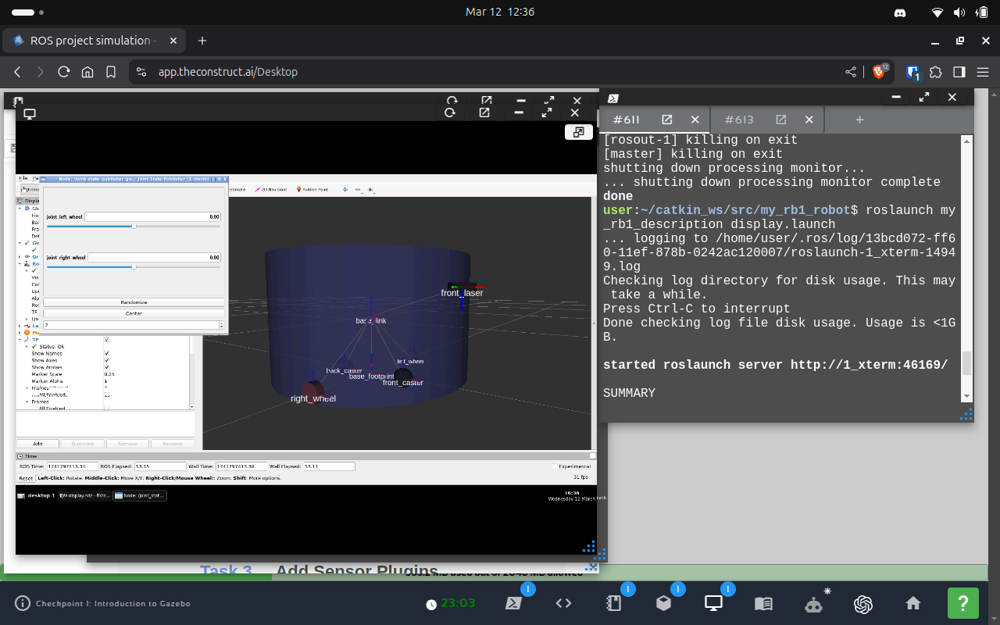
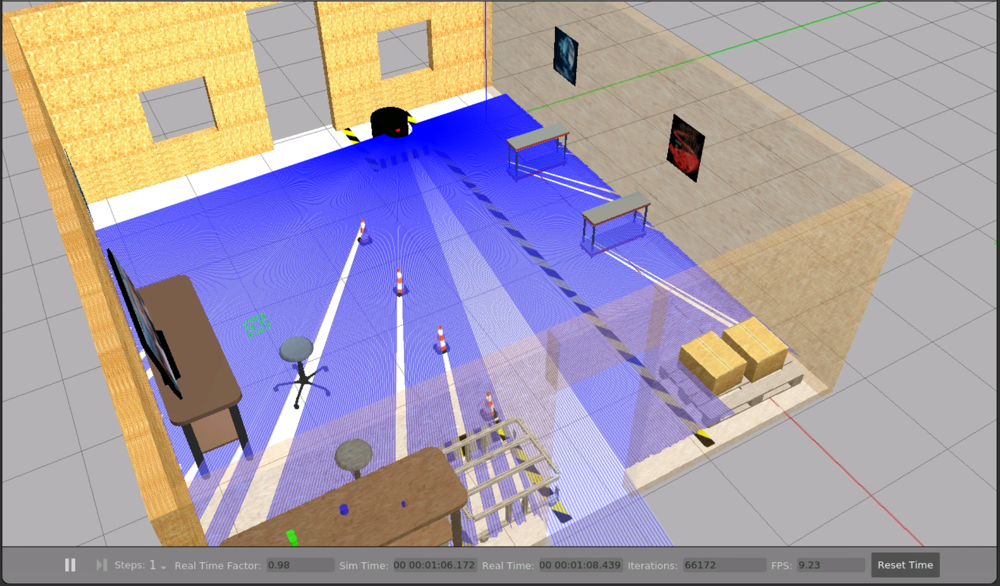

# Robot URDF for ROS and Gazebo

This project involves creating a detailed URDF model of RB1 robot for use with ROS and Gazebo. The model includes essential components and sensors, enabling simulation of realistic robot behavior in a Gazebo environment. The robot can be controlled to move within the simulated world, providing a foundation for further development and experimentation in robot simulation and navigation.

---

  
  

